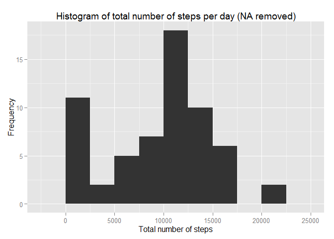
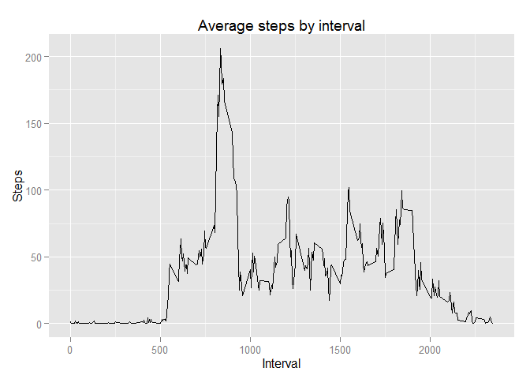
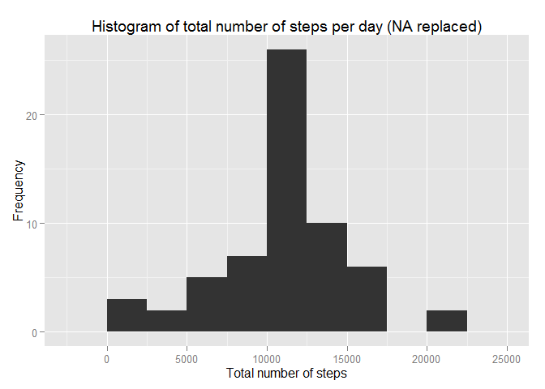
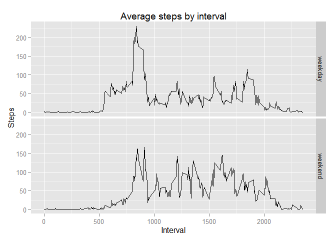

# Reproducible Research: Peer Assessment 1


## Loading and preprocessing the data

1. Load the data (i.e. read.csv())

Load the data using the read.csv() command. We can already assign the column types here.


```r
data = read.csv(file = './activity/activity.csv', colClasses = c("integer","Date","numeric"))
```


Load required packages.


```r
library(dplyr)
```

```
## 
## Attaching package: 'dplyr'
## 
## The following objects are masked from 'package:stats':
## 
##     filter, lag
## 
## The following objects are masked from 'package:base':
## 
##     intersect, setdiff, setequal, union
```

```r
library(ggplot2)
```


## What is mean total number of steps taken per day?

1. Calculate the total number of steps taken per day

In order to calculate the mean total number of steps taken per day, we can use the group_by() and summarise() functions in the dplyr package. When calling the summarise() function, we are excluding missing values for our analysis.


```r
## Group data set by date and get number of total steps per date
dfTotalNumberOfSteps = data %>% group_by(date) %>% summarise(total = sum(steps, na.rm = TRUE)) 
```

2. Make a histogram of the total number of steps taken each day


```r
## Use ggplot to render histogram
ggplot(dfTotalNumberOfSteps, aes(total)) + geom_histogram(binwidth=2500) + labs(x="Total number of steps", y = "Frequency", title="Histogram of total number of steps per day (NA removed)")
```

 

3. Calculate and report the mean and median of the total number of steps taken per day


```r
mean(dfTotalNumberOfSteps$total)
```

```
## [1] 9354.23
```

```r
median(dfTotalNumberOfSteps$total)
```

```
## [1] 10395
```

## What is the average daily activity pattern?

1. Make a time series plot (i.e. type = "l") of the 5-minute interval (x-axis) and the average number of steps taken, averaged across all days (y-axis)

For the average daily activity pattern, we can use the aggregate() function to aggregate steps by interval to calculate the mean.


```r
## Aggregate steps by interval and use mean as list calulation
dfAverageDailyActivity = aggregate(steps ~ interval, data = data, FUN = "mean", na.rm = TRUE)

# Use ggplot to render line chart
ggplot(dfAverageDailyActivity, aes(interval, steps)) + geom_line() + labs(x="Interval", y = "Steps", title="Average steps by interval")
```

 

2. Which 5-minute interval, on average across all the days in the dataset, contains the maximum number of steps?


```r
dfAverageDailyActivity[which.max(dfAverageDailyActivity$steps),]
```

```
##     interval    steps
## 104      835 206.1698
```

The 5-minute interval with the maximum number of steps is 835 (206.17 steps).


## Inputing missing values

1. Calculate and report the total number of missing values in the dataset (i.e. the total number of rows with NAs)


```r
sum(is.na(data$steps))
```

```
## [1] 2304
```

2. Devise a strategy for filling in all of the missing values in the dataset. The strategy does not need to be sophisticated. For example, you could use the mean/median for that day, or the mean for that 5-minute interval, etc.

We can use the daily average data set to replace missing values in the original data set with the mean value for this interval.

3. Create a new dataset that is equal to the original dataset but with the missing data filled in.

```r
## Define a function to replace the NA value with the average number of steps for a current activity
replace = function(steps, interval) {
  value = NA
  if (!is.na(steps)) 
    ## Value found, do not replace with mean
    value = c(steps)
  else 
    #Value is NA, lookup mean for current interval from average daily activity data set
    value = dfAverageDailyActivity[dfAverageDailyActivity$interval== interval, "steps"]
  return(value)
}

## Get copy of original data set and use mapply() to replace all NAs in the data set
dfReplacedData = data
dfReplacedData$steps = mapply(replace, dfReplacedData$steps, dfReplacedData$interval)

## Group new corrected data set by date and get number of total steps per date
dfTotalNumberOfStepsCorrected = dfReplacedData %>% group_by(date) %>% summarise(total = sum(steps, na.rm = TRUE)) 
```

4. Make a histogram of the total number of steps taken each day and Calculate and report the mean and median total number of steps taken per day. Do these values differ from the estimates from the first part of the assignment? What is the impact of imputing missing data on the estimates of the total daily number of steps?


```r
## Use ggplot to render histogram
ggplot(dfTotalNumberOfStepsCorrected, aes(total)) + geom_histogram(binwidth=2500) + labs(x="Total number of steps", y = "Frequency", title="Histogram of total number of steps per day (NA replaced")
```

 

```r
mean(dfTotalNumberOfStepsCorrected$total)
```

```
## [1] 10766.19
```

```r
median(dfTotalNumberOfStepsCorrected$total)
```

```
## [1] 10766.19
```

The values for the median and mean differ from the original dataset. Inputing missing values increases the median and mean as there is more data.

## Are there differences in activity patterns between weekdays and weekends?

1. Create a new factor variable in the dataset with two levels - "weekday" and "weekend" indicating whether a given date is a weekday or weekend day.


```r
## Define a function to calculate the weekday based on a given date 
checkDay = function(date) {
  day = weekdays(date)
  if (day %in%  c("Saturday", "Sunday"))
      return("weekend")
  else
    return("weekday")
}

# Add a column for the weekday/weekend indicator
dfReplacedData$day = sapply(dfReplacedData$date, FUN=checkDay)
```

2. Make a panel plot containing a time series plot (i.e. type = "l") of the 5-minute interval (x-axis) and the average number of steps taken, averaged across all weekday days or weekend days (y-axis).


```r
## Aggregate steps by interval and use mean as list calulation
dfAverageDailyActivityCorrectedByDay = aggregate(steps ~ interval + day, data = dfReplacedData, FUN = "mean", na.rm = TRUE)

# USe ggplot to render line chart
ggplot(dfAverageDailyActivityCorrectedByDay, aes(interval, steps)) + geom_line() + facet_grid(day ~ .) + labs(x="Interval", y = "Steps", title="Average steps by interval")
```

 
